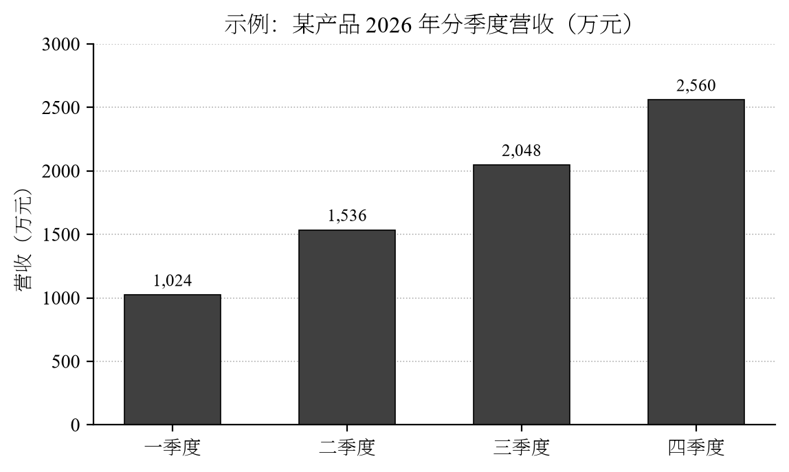

# 概述

本文档覆盖 Markdown 转换中的全部高频元素，用于检验 md-convert 的排版质量：中文宋体、西文 Times New Roman、**Heavy 字重强调**、三线表、原生公式、代码样式与题注。转换命令：

```bash
python scripts/md_convert.py examples/demo.md -o demo.docx --toc
```

核心主张是**排版质量决定文档可信度**：中文强调应当使用 **Heavy 字重**而非伪粗体，如 **模型在 MMLU 基准上取得 86.4 分**；西文强调保持 Times New Roman Bold（**Bold Text**），二者在加粗时自动拆分处理。

中文斜体映射为楷体：*这里应当是楷体直立显示*，而西文斜体正常倾斜 *ceteris paribus*。删除线效果：~~已废弃的方案~~。行内代码使用等宽字体：`pip install md-convert`。

# 数学公式

行内公式：质能方程 $E = mc^2$ 与高斯积分 $\sigma = \sqrt{\frac{1}{N}\sum_{i=1}^{N}(x_i-\mu)^2}$。

块级公式（高斯积分）：

$$\int_{-\infty}^{+\infty} e^{-x^{2}}\,\mathrm{d}x = \sqrt{\pi}$$

多行对齐（麦克斯韦方程组节选）：

$$
\begin{aligned}
\nabla \cdot \mathbf{E} &= \frac{\rho}{\varepsilon_0} \\
\nabla \cdot \mathbf{B} &= 0
\end{aligned}
$$

# 表格

标准三线表，含对齐方式与中文表头（表头自动加粗并规范化字重）：

| 指标 | 第一季度 | 第二季度 | 第三季度 | 第四季度 |
|:-----|-------:|-------:|-------:|-------:|
| 营收（万元） | 1,024 | 1,536 | 2,048 | 2,560 |
| 同比增长 | 12.5% | 18.2% | 25.0% | 31.4% |
| 毛利率 | 41.3% | 43.6% | 45.8% | 47.2% |

: 表 1 某产品 2026 年分季度经营指标（示意数据）

长文本单元格测试：

| 转换特性 | 说明 | 状态 |
|:---------|:-----|:----:|
| 原生公式 | LaTeX 数学转 Word OMML，可在 Word 中继续编辑 | 支持 |
| 目录域 | 打开文档时自动刷新页码，打印前无需手动处理 | 支持 |
| Heavy 强调 | 中文加粗使用思源宋体 Heavy 字重，避免伪粗体的笔画发虚 | 支持 |

: 表 2 核心特性一览

# 代码

Python 示例（含行内中文注释）：

```python
def convert(markdown_path: str, output: str, *, toc: bool = True) -> None:
    """Markdown 转 docx，默认生成可刷新目录。"""
    argv = [markdown_path, "-o", output]
    if toc:
        argv.append("--toc")
    exit_code = md_convert.main(argv)
    assert exit_code == 0, f"转换失败：exit={exit_code}"
```

Shell 示例：

```bash
# 批量转换当前目录全部 md 文件
for f in *.md; do
  python md_convert.py "$f" -o "dist/${f%.md}.docx" --toc
done
```

# 列表与引用

转换管线遵循以下顺序：

1. 解析参数与目标格式；
2. 生成受控样式的 reference.docx；
3. 调用 pandoc 完成主体转换；
4. 执行后处理：
   - 表格边框（默认三线表）；
   - 中文加粗字重规范化；
   - 目录域刷新标记。

> 引用块：排版规范的执行应当由工具保证，而不是依赖人工检查。
> 多段引用中的第二段仍保持缩进与边线。

# 图

{width=3.6in}

# 其他元素

脚注测试：本文档由 md-convert 转换生成[^1]。

[^1]: 脚注渲染为小号宋体，西文保持 Times New Roman。

外部链接：<https://github.com/whlle-yi/md-convert-skill>，以及[仓库 README](https://github.com/whlle-yi/md-convert-skill#readme)。

---

以上元素全部通过后，产物即达到交付标准。
